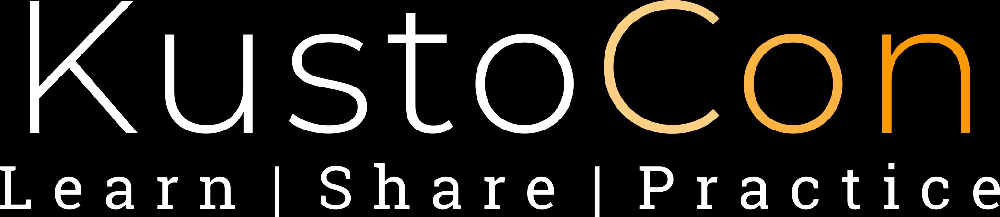
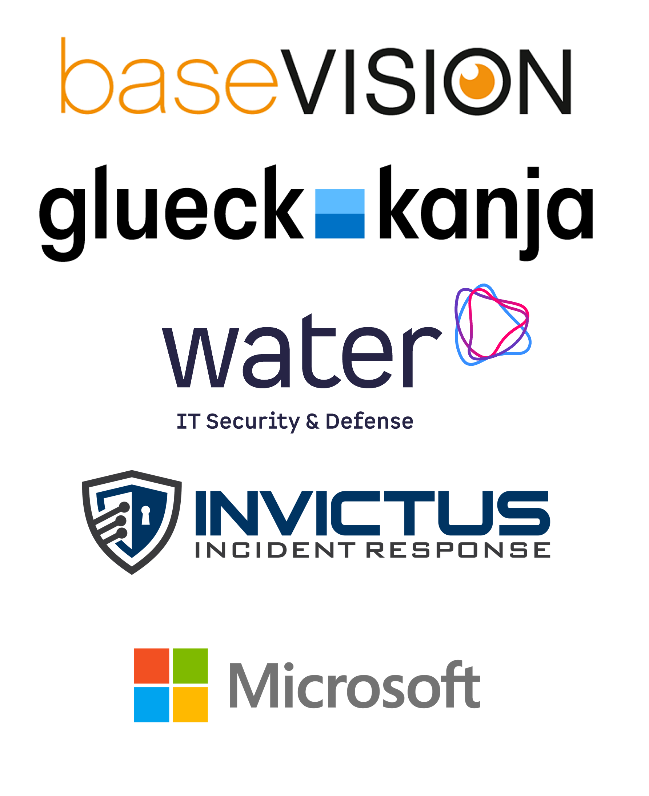

# KustoCon 2025

 

KustoCon 2025 took place on November 6th at the Circle Microsoft Office Zurich Airport and Online.

Conference Organizers [Alex Verboon](https://www.linkedin.com/in/verboonalex/) , [Gianni Castaldi](https://www.linkedin.com/in/giannicastaldi/) and
[Frans Oudendorp](https://www.linkedin.com/in/fransoudendorp/)

For more details see [KustoCon.com](https://kustocon.com/)

## KustoCon 2025 Sessions

### Accelerating Innovation with KQL

[Henning Rauch](https://www.linkedin.com/in/henning-rauch-adx/)

### Securing Endpoints at Scale: Using Security Copilot to Query, Detect & Respond

### From Edges to Nodes: Attack Path Discovery in Kusto

### Proactive Exposure hunting with Enterprise Exposure graph

### Practical Kusto for Defenders

### Automating Incident Response with the Power of Kusto

## Your Feedback counts

If you attended KustoCon 2025, please let us konw about your experience and fill in this [feedback form](https://forms.microsoft.com/e/KdTgwihMP0)

***Thanks to our sponsors***

 