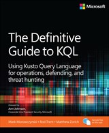
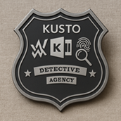
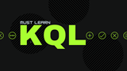
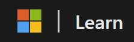

# Learn & Practice Kusto Query Language (KQL)

## KQL Search

KQLSearch.com is a community-driven search engine designed to help users find and share useful Kusto Query Language (KQL) snippets. It aggregates KQL queries from public sources like GitHub and documentation, making it easier to discover ready-made queries for Microsoft tools like Defender, Sentinel, Log Analytics, and Azure Data Explorer. It’s especially useful for security analysts, engineers, and learners looking for inspiration or quick solutions.

- [KQLSearch](https://www.kqlsearch.com/)

## The Definitive Guide to KQL: Using Kusto Query Language for operations, defending, and threat hunting

- [Order here](https://www.microsoftpressstore.com/store/definitive-guide-to-kql-using-kusto-query-language-9780138293383)
- [GitHub](https://github.com/KQLMSPress/definitive-guide-kql)

## Azure Data Explorer Free Cluster

The Azure Data Explorer free cluster is a no-cost, fully managed environment designed to help users learn and explore Kusto Query Language (KQL). It provides a quick and easy way to run queries, ingest sample data, and experiment with powerful analytics features—without needing to set up or pay for infrastructure. Ideal for beginners and learners, it supports hands-on practice for scenarios like log analytics, telemetry analysis, and interactive data exploration.

[free Azure Data Explorer cluster](https://learn.microsoft.com/en-us/azure/data-explorer/start-for-free-web-ui)

## Kusto Detective Agency

The Kusto Detective Agency is an interactive mystery-solving challenge that teaches Kusto Query Language (KQL) through fun, data-driven investigations.

- [Kusto Detective Agency](https://detective.kusto.io/)

## Mut Learn KQL

- [GitHub](https://github.com/rod-trent/MustLearnKQL)
- [Must Learn KQL - the Book](https://github.com/rod-trent/MustLearnKQL/tree/main/Book_Version)
- [The KQL Mysteries](https://github.com/rod-trent/KQLMysteries)
- [YouTube](https://www.youtube.com/playlist?list=PLsHyMQ1fyeuLAMmNeHXfQFV7MKP-VshPO)

## Blue Raven Academy

Elevate your threat hunting, detection engineering, and incident response skills with our transformative training courses, offering hands-on experience in a hyper-realistic lab environment!

Blue Raven Academy provides FREE and Paid KQL Training Courses

- [Blue Raven Academy](https://academy.bluraven.io/)

## Ten Minute KQL

Learn Kusto Query Language (KQL) from zero experience to an advanced level in 10-minute sessions.

- [YouTube](https://www.youtube.com/@TenMinuteKQL)

## KQL Cafe

- [YouTube](https://www.youtube.com/@KQLCafe)

## Microsoft Learn

- [Kusto Query Language overview](https://learn.microsoft.com/en-us/kusto/query/?view=microsoft-fabric)
- [Find KQL related training on Microsoft Learn](https://learn.microsoft.com/en-us/search/?terms=kql&category=Training)
