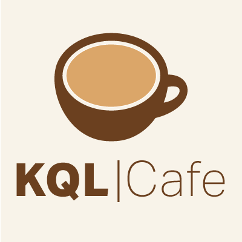

# Welcome to KQL Cafe

 

## Our Mission

- A Community to make the world a better place with KQL
- Learn, share and practice the KQL language

## What is KQL Cafe?

KQL Cafe is a community-driven event series focused on Kusto Query Language (KQL), which is used primarily in Microsoft technologies like Azure Data Explorer, Microsoft Sentinel, Defender XDR and Microsoft Intune for querying and analyzing large volumes of data.

The "Cafe" concept gives it a casual, community-friendly vibe — like a meet-up over coffee, but for learning and sharing knowledge around KQL. Our sessions typically feature:

- Expert talks and guest speakers
- Real-world use cases and demos
- Interactive Q&A sessions
- Tips and tricks for writing and optimizing KQL queries

## Follow us

- Follow us on [BlueSky](https://bsky.app/profile/kqlcafe.bsky.social)
- Follow us on [Twitter](https://twitter.com/KqlCafe)
- Join our KQLCafe [Meetups](https://www.meetup.com/kql-cafe)
- Join our group on [LinkedIn](https://www.linkedin.com/groups/14053778/)
- Watch the KQL Cafe session videos on [YouTube](https://www.youtube.com/channel/UCUJwJO79TYZdnpQ9WWtzQDg/featured)

[Code of Conduct](./Code%20of%20Cnoduct.md)

## Show hosts

- [Gianni Castaldi](https://www.linkedin.com/in/giannicastaldi/)
- [Alex Verboon](https://www.linkedin.com/in/verboonalex/)

## Community Contributions

If you'd like to share your query with the community, feel free to share it via [kqlsearch.com](https://www.kqlsearch.com) [Submit Query](https://www.kqlsearch.com/submit)

## Registration

 

- [All Events](https://www.meetup.com/kql-cafe/)

## Upcoming Shows

| Date | Time | Registration | Guest Speaker |
| ---- | ---- | ------------ | ------------- |
| May 27,2025 | 6pm - 7:30pm |[Meetup](https://www.meetup.com/kql-cafe/events/307144777/?utm_medium=referral&utm_campaign=share-btn_savedevents_share_modal&utm_source=link) |  [Michalis Michalos](https://www.linkedin.com/in/mmihalos/) & [Christos Galanopoulos](https://www.linkedin.com/in/christos-galanopoulos/) |
| June 23,2025 | 6pm - 7:30pm |[Meetup](https://www.meetup.com/kql-cafe/events/307145003/?utm_medium=referral&utm_campaign=share-btn_savedevents_share_modal&utm_source=link) | [Thomas Naunheim](https://www.linkedin.com/in/thomasnaunheim/) |
| August 26,2025 | 6pm - 7:30pm | [Meetup](https://www.meetup.com/kql-cafe/events/307290090/?utm_medium=referral&utm_campaign=share-btn_savedevents_share_modal&utm_source=link) | [Mona Ghadiri](https://www.linkedin.com/in/monaghadiri/) |
| October 28,2025 | 6pm - 7:30pm | [Meetup](https://www.meetup.com/kql-cafe/events/307290144/?utm_medium=referral&utm_campaign=share-btn_savedevents_share_modal&utm_source=link) | [Yoan Schinck](https://www.linkedin.com/in/yoan-schinck-740b6a122/) |

> We start at 6pm Amsterdam/Zurich CET

> Sydney, 4 AM (Next Day), Perth, 1 AM (Next Day), Kuala Lumpur, 1 AM (Next Day), Mumbai, 10:30 PM, Tel-Aviv, 8 PM, Johannesburg, 7 PM, Rio de Janeiro, 2 PM, New York, 12 PM, Toronto, 12 PM, Houston, 11 AM, Seattle, 9 AM

## Past Shows

### 2025

| Date            | Show Notes     | Recording | Guest Speaker    |
| --------------- | -------------- | ------------ | ------------- |
| January 28,2025 | [January 2025](./shownotes/2025/KQL%20Cafe%20-%20January%202025.md) | [YouTube](https://www.youtube.com/watch?v=4tZL5sW-Dbo) | [Ian Hanley](https://www.linkedin.com/in/ianhanley/) |
| February 25,2025 | [February 2025](./shownotes//2025/KQL%20Cafe%20-%20February%202025.md) | [YouTube](https://youtu.be/B9fbGszXE04) |  [Uri Barash](https://www.linkedin.com/in/uribarash/) |
| March 18,2025 | [March 2025](/docs/shownotes/2025/KQL%20Cafe%20-%20March%202025.md) | [YouTube](https://www.youtube.com/watch?v=znT_gdYi5Tw) |  [Sergio Albea](https://www.linkedin.com/in/sergioalbea/) |
| April 29,2025 | [April 2025](/docs/shownotes/2025/KQL%20Cafe%20-%20April%202025.md) | [YouTube](https://www.youtube.com/@KQLCafe) |  [Bert-Jan](https://twitter.com/BertJanCyber) |

### 2024

| Date            | Show Notes     | Recording | Guest Speaker    |
| --------------- | -------------- | ------------ | ------------- |
| January 30,2024 | [January 2024](./shownotes/2024/KQL%20Cafe%20-%20January%202024.md) | [YouTube](https://www.youtube.com/watch?v=42SMCTXBlAM) | [Ilana Waitser](https://www.linkedin.com/in/ilana-waitser-368b911/) and [Elyran Malka](https://www.linkedin.com/in/elyran/) |
| Febaruary 27,2024 | [February 2024](./shownotes/2024/KQL%20Cafe%20-%20February%202024.md) | [YouTube](https://youtu.be/d-Bw1OsZzMs?si=rpHFVL5--t0c0s_5) |  [Fabian Bader](https://twitter.com/fabian_bader) |
| March 26,2024 | [March 2024](./shownotes/2024/KQL%20Cafe%20-%20March%202024.md) | [Youtube](https://youtu.be/iz6UPgOjD-k?si=WmzVdjDylyJK4hSS) | [Purav Desai](https://github.com/puravspoint) |
| April 30, 2024 | [April 2024](./shownotes/2024/KQL%20Cafe%20-%20April%202024.md) | [Youtube](https://www.youtube.com/watch?v=o-PKZks9NI4) | [Henning Rauch](https://www.linkedin.com/in/henning-rauch-adx/) |
| May 28,2024 | [May 2024](./shownotes/2024/KQL%20Cafe%20-%20May%202024.md) | [Youtube](https://www.youtube.com/watch?v=lKB1sfZuDio&t=5s) |  [Nicola Suter](https://twitter.com/nicolonsky) |
| June 25 2024 | [June 2024](./shownotes/2024/KQL%20Cafe%20-%20June%202024.md) | [YouTube](https://www.youtube.com/watch?v=Ts8EPurTwpk) | [Michalis Michalos](https://www.linkedin.com/in/mmihalos/) |
| August 20 2024 | [August 2024](./shownotes/2024/KQL%20Cafe%20-%20August%202024.md) | [YouTube](https://www.youtube.com/watch?v=iX-TSOjfDYA) | [Truvis Thornton](https://x.com/thattechkitten) |
| October 29 2024 | [October 2024](./shownotes/2024/KQL%20Cafe%20-%20October%202024.md) | [Youtube](https://www.youtube.com/watch?v=vD9gsQzIZnI) |  [Koos Goosens](https://x.com/KoosGoossens) |
| November 26 2024 | [November 2024](./shownotes/2024/KQL%20Cafe%20-%20November%202024.md) | [Youtube](https://www.youtube.com/watch?v=lcN4LBtPKPk) | [Mehmet Ergene](https://twitter.com/Cyb3rMonk) |

### 2023

| Date | Show Notes | Recording | Guest Speaker |
| ---- | ----------- | -------- | ---------- |
| January 31,2023 | [January 2023](./shownotes/2023/KQL%20Cafe%20-%20January%202023.md) | [YouTube](https://youtu.be/_Gk998QVE1U) | [Rogier Dijkman](https://twitter.com/DijkmanRogier) |
| February 28,2023 | [February 2023](./shownotes/2023/KQL%20Cafe%20-%20February%202023.md) | [YouTube](https://youtu.be/JGyyyhESsz4) | [Ugur Koc](https://twitter.com/UgurKocDe) |
| April 4,2023 | [April 2023](./shownotes/2023/KQL%20Cafe%20-%20April%20I%202023.md) | [YouTube](https://youtu.be/GpP-oP5O8iA) | [Alexander Sloutsky](https://www.linkedin.com/in/sloutsky/) |
| April 25,2023 | [April 2023](./shownotes/2023/KQL%20Cafe%20-%20April%20II%202023.md) | [YouTube](https://youtu.be/Fv0I7aa_P3k) |  [Thijs Leconte](https://twitter.com/thijslecomte) |
| May 23 | [May 2023](./shownotes/2023/KQL%20Cafe%20-%20May%202023.md) | [YouTube](https://youtu.be/EW_UMa3jwRE) | [Clive Watson](https://www.linkedin.com/in/clive-watson/) |
| June 27 | [June 2023](./shownotes/2023/KQL%20Cafe%20-%20June%202023.md) |  [YouTube](https://youtu.be/OgmkzDoPl6w) | Gianni & Alex |
| September 19 | [September 2023](./shownotes/2023/KQL%20Cafe%20-%20September%202023.md) | [YouTube](https://www.youtube.com/watch?v=W-bbLQMkiVE) | [Brian Bønk](https://twitter.com/brbonk) |
| October 31 | [October 2023](./shownotes/2023/KQL%20Cafe%20-%20October%202023.md) | [YouTube](https://www.youtube.com/watch?v=00kN_7uITTI) | [Morten Knudsen](https://twitter.com/knudsenmortendk) |
| November 28 | [November 2023](./shownotes/2023/KQL%20Cafe%20-%20November%202023.md) | [YouTube](https://www.youtube.com/watch?v=gM4C4RpEDqA) | [Ugur Koc](https://twitter.com/UgurKocDe) |

### 2022

| Date | Show Notes | Recording |  Guest Speaker |
| ---- | ----------- | -------- | ---------- |
| January 25,2022 |  [Hello KQL](./shownotes/2022/KQL%20Cafe%20-%20%20January%202022.md) | [YouTube](https://youtu.be/hD_j2XqXc_o) | [Rod Trent](https://twitter.com/rodtrent) |
| February  22,2022 | [Hello from Down Under](./shownotes/2022/KQL%20Cafe%20-%20February%202022.md) | [YouTube](https://www.youtube.com/watch?v=HTCuh-tYLho) | [Matt Zorich](https://twitter.com/reprise_99) |
| March 22,2022 |  [KQL Workbooks](./shownotes/2022/KQL%20Cafe%20-%20March%202022.md) | [YouTube](https://youtu.be/_EHYIRbRHeU) | [Matthew Lowe](https://www.linkedin.com/in/matthew-lowe-13b61990/) |
| April 26, 2022 | [Detections](./shownotes/2022/KQL%20Cafe%20-%20April%202022.md) | [YouTube](https://www.youtube.com/watch?v=ianz3iCsRJI) |   [Olaf Hartong](https://twitter.com/olafhartong) |
| May 31, 2022 |  [Scan Operator](./shownotes/2022/KQL%20Cafe%20-%20May%202022.md) | [YouTube](https://www.youtube.com/watch?v=z8cFNG9ofm0)  | [Mehmet Ergene](https://twitter.com/Cyb3rMonk) |
| June 28,2022 |  [KQL Cafe June 22](./shownotes/2022/KQL%20Cafe%20-%20June%202022.md) | [YouTube](https://www.youtube.com/watch?v=igGo-XtG340) | No guest speaker |
| August 30 |  [KQL Cafe August 29](./shownotes/2022/KQL%20Cafe%20-%20August%202022.md) | [YouTube](https://www.youtube.com/watch?v=j0kUiW_Ip7A) |  [Ashwin Patil](https://twitter.com/ashwinpatil) |
| September 27 | [KQL Cafe September 27](./shownotes/2022/KQL%20Cafe%20-%20September%202022.md) | [YouTube](https://youtu.be/cdlUasvgpg8) | [Mattias Borg](https://twitter.com/MattiasBorg82) |
| October 25 | [KQL Cafe October 25](./shownotes/2022/KQL%20Cafe%20-%20October%202022.md) | [YouTube](https://youtu.be/kLuiueOD9LI) | [Jan Ketil Skanke](https://twitter.com/JankeSkanke) |
| November 29 | [KQL Cafe November 29](./shownotes/2022/KQL%20Cafe%20-%20November%202022.md) | [YouTube](https://youtu.be/XB_VXKCS0Kk) | [BertJanCyber](https://twitter.com/BertJanCyber) |
