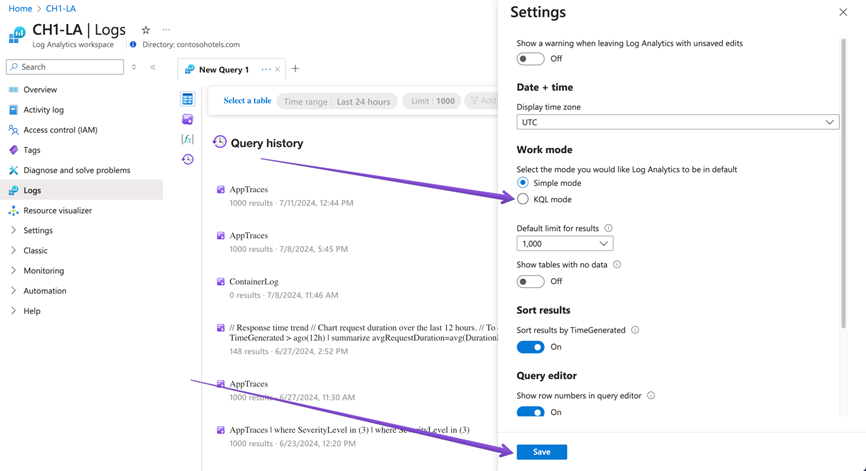

# KQL Cafe - August 2024

## Recording and Presentation

- [Recording]()
- [Presentation](/docs/Presentations/KQL%20Cafe%20-%20August%202024.pdf)

## Hosts

- [Gianni](https://twitter.com/castello_johnny)
- [Alex](https://twitter.com/alexverboon)

## Guests

- [Truvis Thornton](https://x.com/thattechkitten)

## News

### KQL Simple Mode in Log Analytics

- [Analyze data using Log Analytics Simple mode (Preview)](https://learn.microsoft.com/en-us/azure/azure-monitor/logs/log-analytics-simple-mode)

Here's some instuctions if you wnat to change the default behaviour for KQL simple mode in log analytics.




### Detect compromised RDP sessions with Microsoft Defender for Endpoint

- [Detect compromised RDP sessions with Microsoft Defender for Endpoint](https://techcommunity.microsoft.com/t5/microsoft-defender-for-endpoint/detect-compromised-rdp-sessions-with-microsoft-defender-for/ba-p/4201003)

> Note:

- Additional properties not yet synched to Sentinel
- Potential additional data volume when storing in Sentinel

### Hunting for Copilot Activities

Use this query to hunt for Copilot activities

```kql
CloudAppEvents
| where ActionType == @"CopilotInteraction“
```

- [KQL queries](https://github.com/SlimKQL/Hunting-Queries-Detection-Rules/blob/main/DefenderXDR/Microsoft%20Defender%20Advanced%20Hunting%20Copilot%20Activities.kql)

### Identify outdated devices through SignIn Logs

Hunt for outdated devices using the Entra ID signin logs

```kql
union isfuzzy=true SigninLogs, AADNonInteractiveUserSignInLogs| where ResultType != 0 and ResultDescription == "Other"| where ResultType == "500061"| distinct Category, Identity
```

- [What’s new in Microsoft Entra – June 2024](https://techcommunity.microsoft.com/t5/microsoft-entra-blog/what-s-new-in-microsoft-entra-june-2024/ba-p/3796387)

### Steven Lim’s aweseome KQL queries are now available on GitHub and KQLSearch.com

- [Steven Lim's KQL queries are now available on GitHub and in KQLSearch](https://github.com/SlimKQL/Hunting-Queries-Detection-Rules)

### Microsoft Sentinel - Summary Rules

Check out this new feature in Microsoft Sentinel


- [Aggregate data in a Log Analytics workspace by using summary rules (Preview)](https://learn.microsoft.com/en-us/azure/azure-monitor/logs/summary-rules?tabs=api)
- [Aggregate Microsoft Sentinel data with summary rules (preview)](https://learn.microsoft.com/en-us/azure/sentinel/summary-rules)

## Guest Speaker Truvis Thornton

- [Truvis Thornton](https://x.com/thattechkitten)

Truvis talked about using AuditD with Microsoft Sentinel

- [Commandline Auditing — Using different tools [AuditD, Snoopy, PSAcct and Native solutions] to monitor security on your Linux server environments](https://medium.com/@truvis.thornton/commandline-auditing-using-different-tools-to-security-your-linux-server-and-environments-2fcd361142ef)

## What did you do with KQL this month?

Gianni talked about how to detect OneDrive activities using the Microsoft Grpah Activitylogs

```kql
MicrosoftGraphActivityLogs 
| where RequestUri endswith "/content" or RequestUri contains "/content?format="
| where ResponseStatusCode == 200 
| where RequestMethod == "GET" 
| where RequestUri matches regex 
    @"https://graph.microsoft.com/(beta|v1.0)/(drives|groups|shares|me|sites|users|drive)/"
```kql
