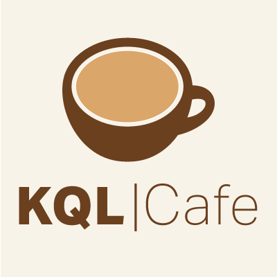

## Welcome to KQL Cafe

    

# Our Mission

- A Community to make the world a better place with KQL
- Learn, share and practice the KQL language 

Follow us on Twitter [@KqlCafe](https://twitter.com/KqlCafe)

# Show hosts

- [Gianni](https://twitter.com/castello_johnny)
- [Alex](https://twitter.com/alexverboon)

# Agenda Upcoming Show January 25, 2022 18:00 - 20:00 CET)

- Welcome , who we are , why, mission statement, what to expect
- Logistics, explain planned agenda topics
- Where do we KQL?
- Learn KQL - Your Playground Options
- KQL Tables, how to find new things
- Working with IOCs
- New Features worth mentioing
- Our KQL Guest  (To be anounced)
- What did you do with KQL this month?
- KQL Challenge of the month

#  Show Dates

All times are Central european timezone

| Date | Time |
| January 25 |  6pm - 8pm |
| February 22 | 6pm - 8pm |
| March 22 | 6pm - 8pm |

